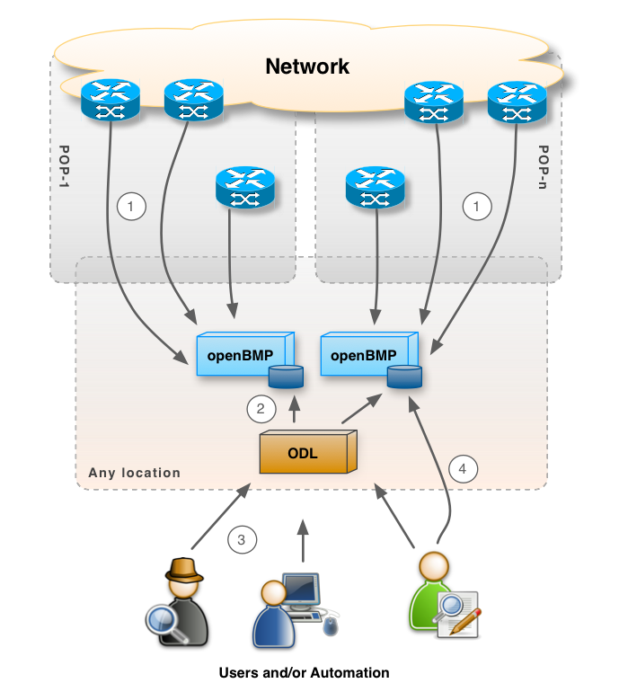

Open BGP Monitoring Protocol (OpenBMP) Collector
================================================

OpenBMP is an open source project that implements **draft-ietf-grow-bmp-07**.  BMP protocol version 3 is defined in draft 07, while versions 1 and 2 are defined in the previous revisions of the draft.

JunOS 10.4 implements the older versions of BMP.   Cisco IOS XE 3.12, IOS XR, and JunOS 13.3 implement version 3 (draft 07).

### Daemon
OpenBMP daemon is a BMP receiver for devices that implement BMP, such as Cisco and Juniper routers.  Collected BMP messages are decoded and stored in a SQL database.

> Raw dumps are on the roadmap

### UI
OpenBMP UI is a Web-App UI that interacts with OpenBMP server/daemon.   Multiple OpenBMP daemons can be centrally managed via the same UI.

### Database
The SQL/transactional database is designed to be flexible for all types of reporting on the collected data by simply linking tables or by creating views.

The database is tuned to support high transactional rates and storage for millions of prefixes and other BGP information.   OpenBMP statistics track how well the database is performing and will alert if there are any issues.

News
----
### Sep-2-2014
> OpenBMP now fully supports draft-ietf-grow-bmp-07

* Added termination message parsing and storage
* Pseudo schema has been updated to include v_peers

### Aug-29-2014
* Fixed an issue with peer down event BMP reason 2 causing the thread to exit.
* Added full support of peer up notifications, including complete decode of the sent and received open message and capabilities.
* Added new "v_peers" table as documented on http://www.openbmp.org/#!docs/DATABASE.md.
* Bumped the current DB to use v1.3-pre2.

### Aug-27-2014
Initiation sysName, sysDescr, and free form string values are now stored.

Termination messages and peer up messages will be added shortly.   The v_peers VIEW does not exist yet
because peer up messages are required.   Once the peer up messages are added (very soon) v_peers will be added.  This will provide a peers view into active neighbors.

New views will be created to provide consolidated reporting statistics per peer, such number of prefixes in RIB and peer down/peer up events.

JunOS 14.1 and IOS XE 3.12 verified.

OpenBMP UI is being revised and will be updated soon.

OpenBMP Flow
------------

1. BMP devices (e.g. routers) send BMP messages to a OpenBMP collector/daemon.   One OpenBMP daemon can handle many routers and bgp peers, but in a large network with transit links and full internet routing tables, multiple OpenBMP daemons is recommended.   Simply configure on the BMP device (router) which BMP server that should be used.  
2. Open Daylight (ODL) controller SQL plugin with SQL <-> Yang interfaces with the OpenBMP database.  ODL in this fashion provides an abstract view of all OpenBMP data.
3. Admins, Network Engineers, automated programs/scripts, etc. interact via ODL northbound interfaces to run various BMP analytics.
4. Admins, Network Engineers, automated programs/scripts, etc. can also go direct to the BMP database as needed. 

Supported Features
------------------
Below is a list of features supported today in OpenBMP.  Many more features are on the roadmap, including BGP-LS (draft-ietf-idr-ls-distribution).   See the **roadmap** for more details. 

Feature | Description
-------: | -----------
draft-ietf-grow-bmp-07| BMP Version 3
Database | Access to all collected data via standard ODBC/DB drivers
IPv4 | IPv4 Unicast routing table information
IPv6 | IPv6 Unicast routing table information
VPNv4 | L3VPN routing information
Prefix Log| Tracking of withdraws and updates by prefix, including path attributes
Advanced Reporting| Built-in views for common reports, such as route tables, prefixes as paths, and route table history of changes

Use-Cases
---------
There are many reasons to use OpenBMP, but to highlight a few common ones:

* **Looking Glasses**  - IPv4, IPv6, and VPN4

* **Route Analytics** - Track convergence times, history of prefixes as they change over time, monitor and track BGP policy changes, etc...

* **Traffic Engineering Analytics**  - Adapt dynamically to change and know what is the best shift

* **BGP pre-policy What-Ifs** - Pre-policy routing information provides insight into all path attributes from various points in the network allowing nonintrusive what-if topology views for new policy validations

* *many more*

Installation and Configuration
------------------------------
See the [docs/INSTALL.md](docs/INSTALL.md) documentation for detailed information on how to install and configure OpenBMP daemon and UI.

The installation documentation provides step by step instructions for how to install and configure OpenBMP, including the database.  

Instructions are for Ubuntu and CentOS/RHEL.   Other Linux distributions should work, but instructions might vary. 

Using Open Daylight
-------------------
See the [docs/ODL.md](docs/ODL.md) documentation for detailed information on how to use Open Daylight with OpenBMP.  

This includes details on how to setup ODL to use OpenBMP database(s).

Interfacing with the Database
-----------------------------
See the [docs/DATABASE.md](docs/DATABASE.md) documentation for the database schema and how to interact with it.    

Release Notes
----------
Check the release notes for changes by release.  

Road Map
--------
Below are a list of features/changes that are targetted in the next release:

### OpenBMP Daemon
* Inbound message caching to offload socket buffers
* New feature to allow saving raw BGP messages based on filters
* Add Ubuntu and Redhat binary packages
* Add OpenBMP statistic counters to database
* Add TCP MD5SIG support for BMP sessions
* Add configuration option to restrict BMP devices to ones provisioned
* Add support for active BMP connections - OpenBMP makes connections to routers
* Add postgres DB support
* Verify and document MariaDB instead of using MySQL on Ubuntu and CentOS
* Implement RFC5424 logging with configuration options to fine tune

### OpenBMP UI
* Add configuration tuning/modification support
* Add OpenBMP statistics
* Add Router and Peering Summary report

Building from Source
--------------------
See the [docs/BUILD.md](docs/BUILD.md) document for details on how to build OpenBMP from source.  Includes how to create DEB and RPM packages. 

