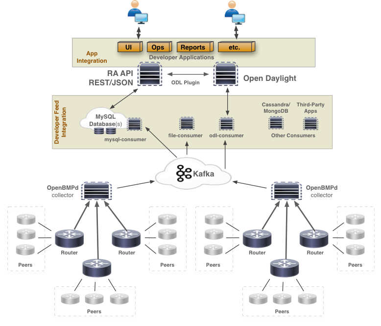

Open BGP Monitoring Protocol (OpenBMP) Collection Framework
===========================================================


OpenBMP is an open source project that implements **draft-ietf-grow-bmp-17**.  BMP protocol version 3 is defined in draft 08, while versions 1 and 2 are defined in the previous revisions of the draft.

JunOS 10.4 implements the older versions of BMP.   Cisco IOS XE 3.12, IOS XR 5.2.2, and JunOS 13.3 implement version 3 (draft 07).

OpenBMP Flow
------------



* BMP devices (e.g. routers) send BMP messages to a OpenBMP collector/daemon.   One OpenBMP daemon can handle many routers and bgp peers, but in a large network with transit links and full internet routing tables, multiple OpenBMP collectors are recommended.   Simply configure on the BMP device (router) which BMP server that should be used.  

* Apache Kafka enables many applications the ability to tap into the existing BMP feeds from any number of routers.  A single BMP feed via OpenBMP can feed data into hundreds of consumer apps, such as MySQL, Cassandra, Real-time monitors, Flat file, ELK, Apache Spark, etc.

* OpenBMP forwarder can be used to forward the native BMP messages (no modification) to any other BMP receiver, including openbmpd.

* Admins, Network Engineers, automated programs/scripts, etc. interact with the OpenBMP API or any other consuming application

Supported Features Highlights
-----------------------------
Below is a list of some key features supported today in OpenBMP.  Many more features exist.

Feature | Description
-------: | -----------
RPKI/IRR | RPKI and IRR integration enables security analysis of monitored prefixes and ASN's.  Try it out using the containers **openbmp/aio** and **openbmp/ui** .
Topic Mapping | Dynamic and customizable topic names. Scale Kafka consumers by partition and topic
draft-ietf-grow-bmp | BMP Version 3 with backwards compatibility with older drafts
Apache Kafka | Producer of parsed and RAW BMP feeds, multiple consumers available
Database | Access to all collected data via standard ODBC/DB drivers (openbmp-mysql-consumer)
File Logging | All parsed messages can be logged to files, including BMP binary streams (openbmp-file-consumer)
IPv4 | IPv4 Unicast routing table information
IPv6 | IPv6 Unicast routing table information
bgp-ls| [RFC7752](https://tools.ietf.org/html/rfc7752)
Extended Communities | Roughly all of them
VPNv4 | L3VPN routing information (within VRF) - *coming soon*

So much more...

### Daemon
OpenBMP daemon is a BMP receiver for devices/software that implement BMP, such as Cisco and Juniper routers. The collector is a highly scalable **producer** to Apache Kafka.   Both RAW BMP messages and parsed messages are produced for Kafka consumer consumption.  

### User Interface
User interface is available in the docker container ```docker pull openbmp/ui```.   You can install the UI by following the docker [UI instructions](https://github.com/OpenBMP/docker/tree/master/ui).   

Soon the UI will be added to github. 

note: The UI uses [DB_REST](docs/DBREST.md) which requires the **mysql-consumer**.  You can install the MySQL consumer and DB_REST using the [mysql container](https://github.com/OpenBMP/docker/tree/master/mysql) or you can use the [aio container](https://github.com/OpenBMP/docker/tree/master/aio)

### Using Logstash with OpenBMP
Logstash is a flexible, open source, data collection, enrichment, and transport pipeline designed to efficiently process a growing list of log, event, and unstructured data sources for distribution into a variety of outputs, including Elasticsearch.

See [Logstash](docs/LOGSTASH.md) for more details and how to use logstash with OpenBMP.

### Openbmp Forwarder
The Openbmp forwarder can be used to connect to one Kafka cluster and to regenerate BMP messages to another collector.  The forwarder consumes the collector, router, peer, and bmp_raw messages and forwards them via 
native BMP.   

See [openbmp-forwarder](https://github.com/OpenBMP/openbmp-forwarder) for more details. 

### Openbmp MRT

A lightweight OpenBMP consumer that dumps BMP messages on a time based interval to a file.
The MRT file can then be loaded in any compliant MRT parser.  Validation testing has been with
[libbgpdump](https://bitbucket.org/ripencc/bgpdump/wiki/Home).

**[RFC6396](https://tools.ietf.org/html/rfc6396)** - Multi-Threaded Routing Toolkit (MRT) Routing Information Export Format

* BGP4MP\_STATE\_CHANGE_AS4 - Peer up/down events
* BGP4MP\_MESSAGE - BGP update messages
* TABLE\_DUMP\_V2 - Table dumps require the use of openbmp-mysql-consumer (MySQL/MariaDB)

See [openbmp-mrt](https://github.com/OpenBMP/openbmp-mrt) for more details. 

### MySQL Consumer
The MySQL consumer implements the OpenBMP Message Bus API parsed messages API to collect and store BMP/BGP data of all collectors, routers, and peers in real-time. The consumer provides the same data storage that OpenBMP collector versions 0.10.x and less implemented.

See [mysql-consumer](http://www.openbmp.org/#!docs/MYSQL_CONSUMER.md) for more details about the MySQL consumer.

### Flat File Consumer
A basic file consumer of OpenBMP parsed and RAW BMP Kafka streams. You can use this file consumer in the following ways:

* Working example to develop your own consumer that works with either parsed or RAW BMP binary messages
* Record BMP feeds (identical as they are sent by the router) so they can be replayed to other BMP parsers/receivers
* Log parsed BMP and BGP messages in plain flat files

See [file-consumer](http://www.openbmp.org/#!docs/FILE_CONSUMER.md) for more details.

### Message Bus (Kafka)
Starting in release 0.11.x Apache Kafka is used as the centralized bus for collector message streams.   The collector no longer forwards direct to MySQL. Instead, database consumers are used to integrate the data into MySQL, Cassandra, MongoDb, Postgres, flat files, etc.  Anyone can now can interact with the BGP parsed and RAW data in a centralized fashion via Kafka or via one of the consumers.   A single BMP feed from one router can be made available to many consumers without the collector having to be aware of that.  


News/Change Log
---------------
Github is the best place to track and keep up with the latest changes.  

See [Openbmp GitHub](https://github.com/OpenBMP)


Use-Cases
---------
There are many reasons to use OpenBMP, but to highlight a few common ones:

* **Centralized BMP Collector** - OpenBMP is a producer to Apache Kafka.  You can write your own consumer or use an existing one.  Other products can interact with OpenBMP via Apache Kafka for RAW BMP streams or the parsed messages.   See [Message Bus API Specification](docs/MESSAGE_BUS_API.md) for more details.

* **Real-Time Topology Monitoring** - Can monitor and alert on topology change, policy changes or lack of enforcement, route-leaking, hijacking, etc.

* **BGP/Route Security** - Route leaking, hijacking by origination, by better transit paths, or deviation from baseline

* **Looking Glasses**  - IPv4, IPv6, and VPN4

* **Route Analytics** - Track convergence times, history of prefixes as they change over time, monitor and track BGP policy changes, etc...

* **Traffic Engineering Analytics**  - Adapt dynamically to change and know what is the best shift

* **BGP pre-policy What-Ifs** - Pre-policy routing information provides insight into all path attributes from various points in the network allowing nonintrusive what-if topology views for new policy validations

* **IGP Topology** - BGP-LS (link-state) provides the complete topology of the IGP (OSPF and/or IS-IS).  The IGP topology provides node, link, and prefix level information.  This includes all BGP next-hops.   It is now possible to do a BGP best path selection with IGP metric for **Adj-In-RIB** information.  It is also possible to monitor the IGP itself as it pertains to links, nodes, prefixes, and BGP.

* *many more*

Installation and Configuration
------------------------------
See the [docs/INSTALL.md](docs/INSTALL.md) documentation for detailed information on how to install and configure OpenBMP daemon and UI.

The installation documentation provides step by step instructions for how to install and configure OpenBMP, including the database.  

Instructions are for Ubuntu and CentOS/RHEL.   Other Linux distributions should work, but instructions might vary.


Using Kafka for Collector Integration
-------------------------------------
See the following docs for more details:

* [CONSUMER\_DEVELOPER\_INTEGRATION](docs/CONSUMER_DEVELOPER_INTEGRATION.md) - Details about Kafka and why it was chosen over AMQP.
* [MESSAGE\_BUS\_API](docs/MESSAGE_BUS_API.md) - Detailed API spec for Parsed and rAW BMP Messages via Kafka

In the future, other feeds can be made available.  We are thinking of adding RAW BGP feeds as well (BMP headers stripped leaving only BGP RAW messages).  This may be useful but currently nobody has requested this. If you are interested in other types of feeds, please contact **tim@openbmp.org**.

Interfacing with the Database
-----------------------------
See the [DB_SCHEMA](http://www.openbmp.org/#!docs/DB_SCHEMA.md) documentation for the database schema and how to interact with it.    


Building from Source
--------------------
See the [BUILD](docs/BUILD.md) document for details on how to build OpenBMP from source.  Includes how to create DEB and RPM packages.


Support by
----------

<a href="http://www.cisco.com"></a>  <a href="http://www.jetbrains.com"></a>
