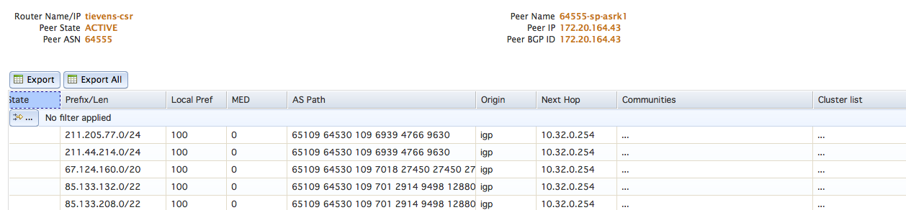
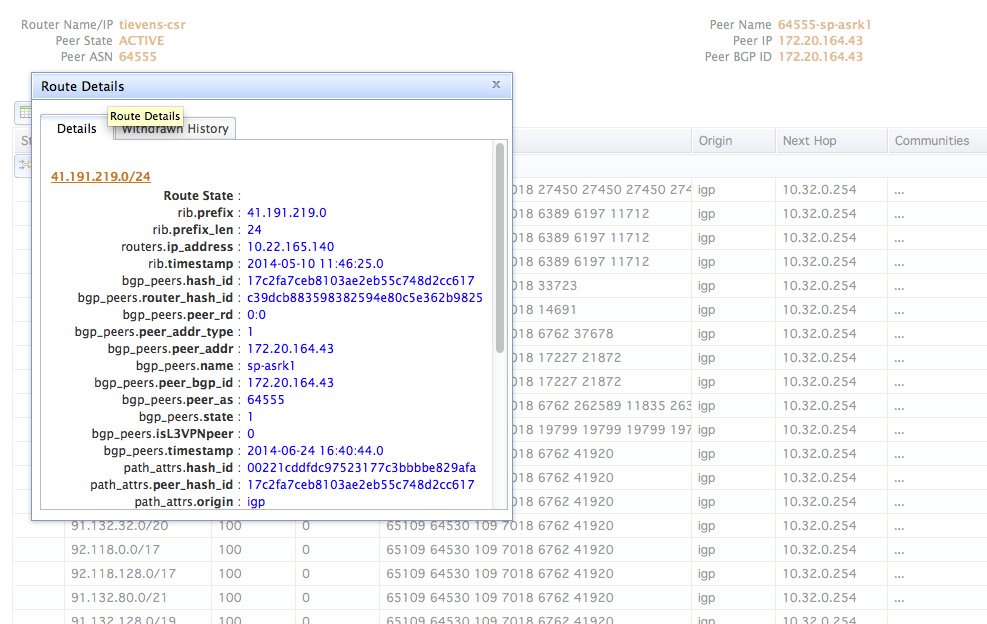
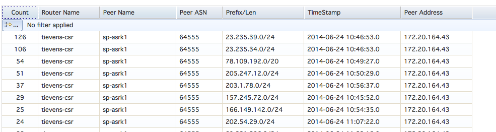

Examples
========

Below are some examples using both the OpenBMP UI and CLI command line mysql client.  ODL examples are coming. 

As described in the documentation, the database is standard SQL and any ODBC or native driver and tool can be used.  Reporting tools like Business Objects can be used as well. 


UI Route Views
--------------
Example screenshots from WebUI. 

**Route View**



** Route Details**



** Withdraws **




MySQL Client
------------

**Routes Example** 


```
MySQL [openBMP]> select RouterName,PeerName,Prefix,PrefixLen,Origin,Origin_AS,MED,LocalPref,NH,AS_Path from routes where prefix like '24.50.20%';
+-------------+----------+-------------+-----------+------------+-----------+------+-----------+-------------+-----------------------------------------------------------------+
| RouterName  | PeerName | Prefix      | PrefixLen | Origin     | Origin_AS | MED  | LocalPref | NH          | AS_Path                                                         |
+-------------+----------+-------------+-----------+------------+-----------+------+-----------+-------------+-----------------------------------------------------------------+
| tievens-csr | sp-asrk1 | 24.50.20.0  |        24 | igp        |      1246 |    0 |       100 | 10.32.0.254 |  65109 64530 109 701 3356 26801 1246                            |
| tievens-csr | sp-asrk1 | 24.50.208.0 |        20 | incomplete |     14638 |    0 |       100 | 10.32.0.254 |  65109 64530 109 7018 11992 14638 14638 14638 14638 14638 14638 |
+-------------+----------+-------------+-----------+------------+-----------+------+-----------+-------------+-----------------------------------------------------------------+
```


**Routes History Example**


```
MySQL [openBMP]> select RouterName,PeerName,Prefix,PrefixLen,Origin,Origin_AS,MED,LocalPref,NH,AS_Path,LastModified  from routes_history where prefix = '24.50.208.0' order by LastModified Desc;
+-------------+----------+-------------+-----------+------------+-----------+------+-----------+-------------+----------------------------------------------------------------------+---------------------+
| RouterName  | PeerName | Prefix      | PrefixLen | Origin     | Origin_AS | MED  | LocalPref | NH          | AS_Path                                                              | LastModified        |
+-------------+----------+-------------+-----------+------------+-----------+------+-----------+-------------+----------------------------------------------------------------------+---------------------+
| tievens-csr | sp-asrk1 | 24.50.208.0 |        20 | incomplete |     14638 |    0 |       100 | 10.32.0.254 |  65109 64530 109 7018 11992 14638 14638 14638 14638 14638 14638      | 2014-06-14 13:40:24 |
| tievens-csr | sp-asrk1 | 24.50.208.0 |        20 | incomplete |     14638 |    0 |       100 | 10.32.0.254 |  65109 64530 109 701 12956 12956 12956 12956 12956 12956 12956 14638 | 2014-06-14 08:02:25 |
| tievens-csr | sp-asrk1 | 24.50.208.0 |        20 | incomplete |     14638 |    0 |       100 | 10.32.0.254 |  65109 64530 109 7018 12956 14638                                    | 2014-05-29 22:24:59 |
+-------------+----------+-------------+-----------+------------+-----------+------+-----------+-------------+----------------------------------------------------------------------+---------------------+
```

