Examples
========

Below are some examples using both the OpenBMP UI and CLI command line mysql client.  

As described in the documentation, the database is standard SQL and any ODBC or native driver and tool can be used.  Reporting tools like Business Objects, Jasper, ... can be used. 

The UI uses the OpenBMP API, which is using the MySQL backend. 


UI Screenshots
================
 
## Top 20 Prefixes updated and withdrawn
Time period customizable
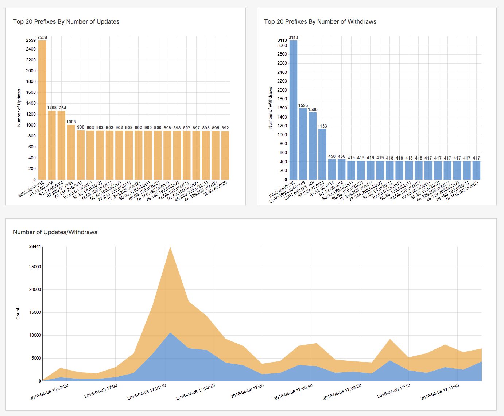


## Peer Info
Similar to ```show bgp neighbor```, which includes the TCP session and capabilities 
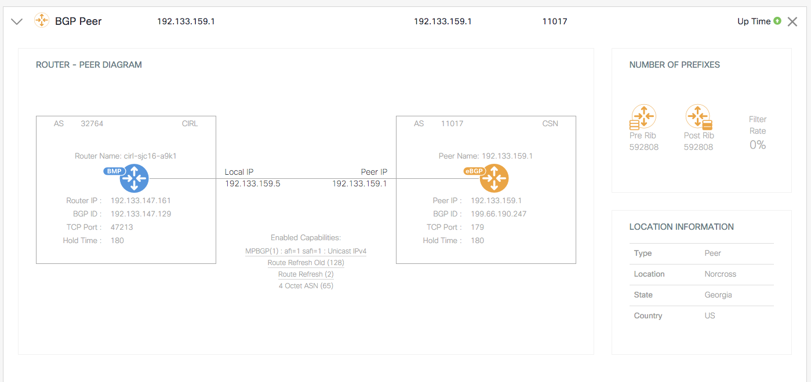


## Security Analysis
Report received origin of prefixes to RPKI and IRR.  IRR data is downloaded once a day.  RPKI is continually updated every few minutes. 
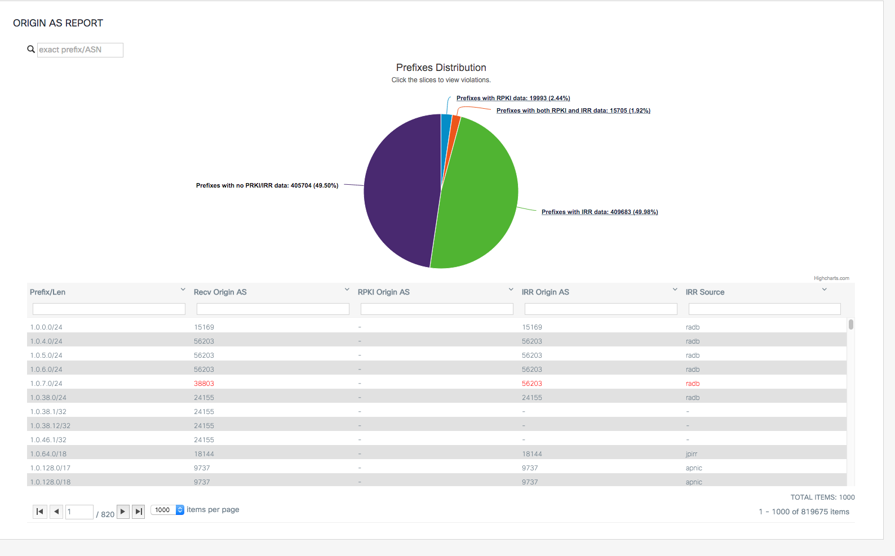


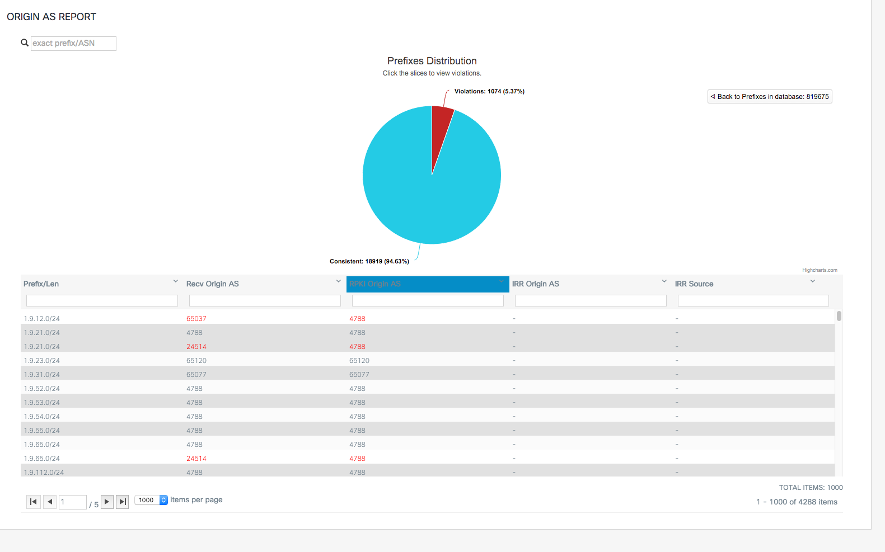

## BGP-LS
BGP-LS provides the link-state topology for either IS-IS and/or OSPF.  SPF's are run per router to build the topology and routing tables.  Run path traces, including the ability to run them with constraints, such as what if this router link didn't exist or what if one was added...

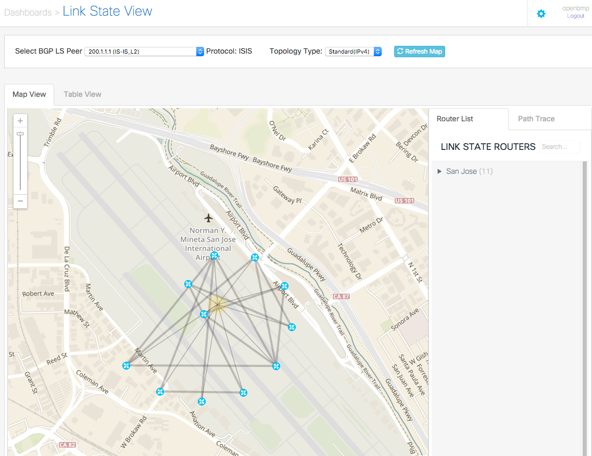
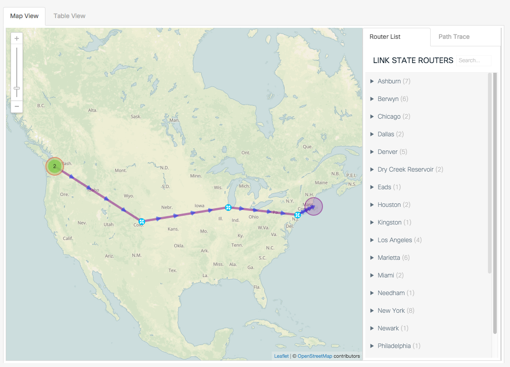
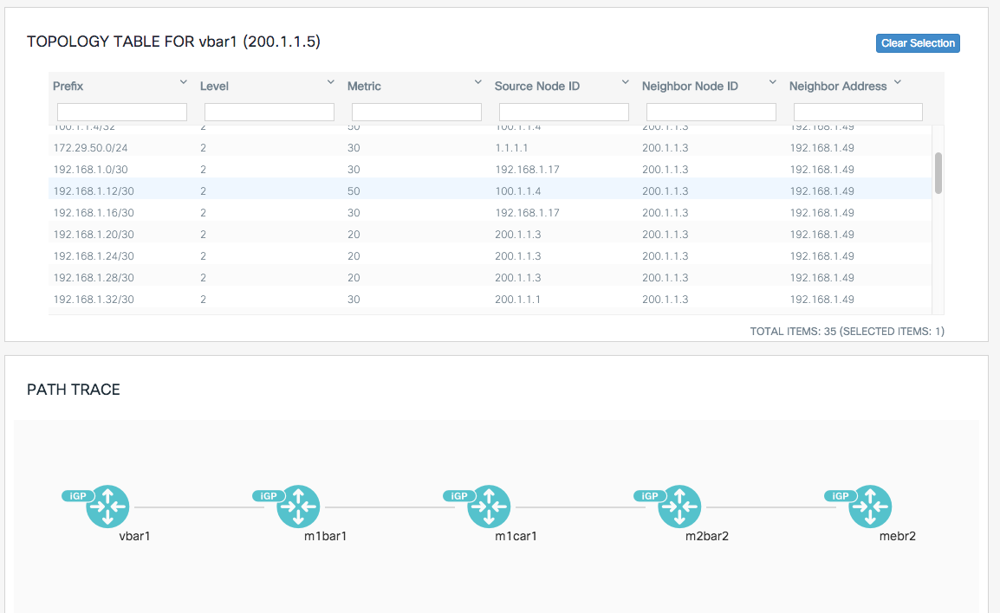


## AS Analysis

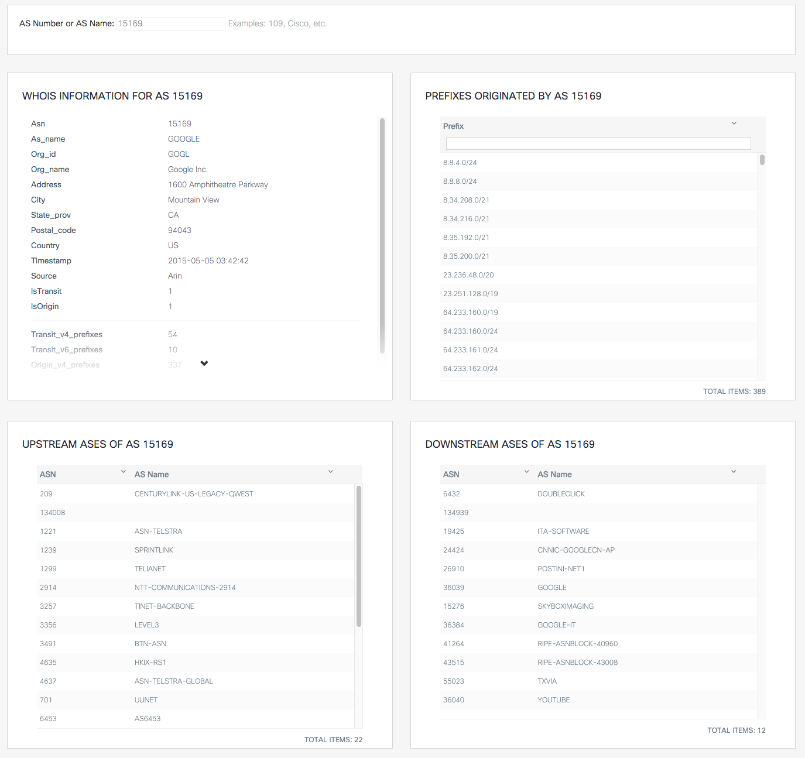
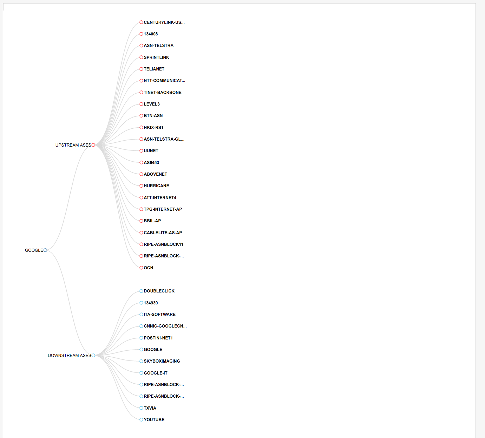
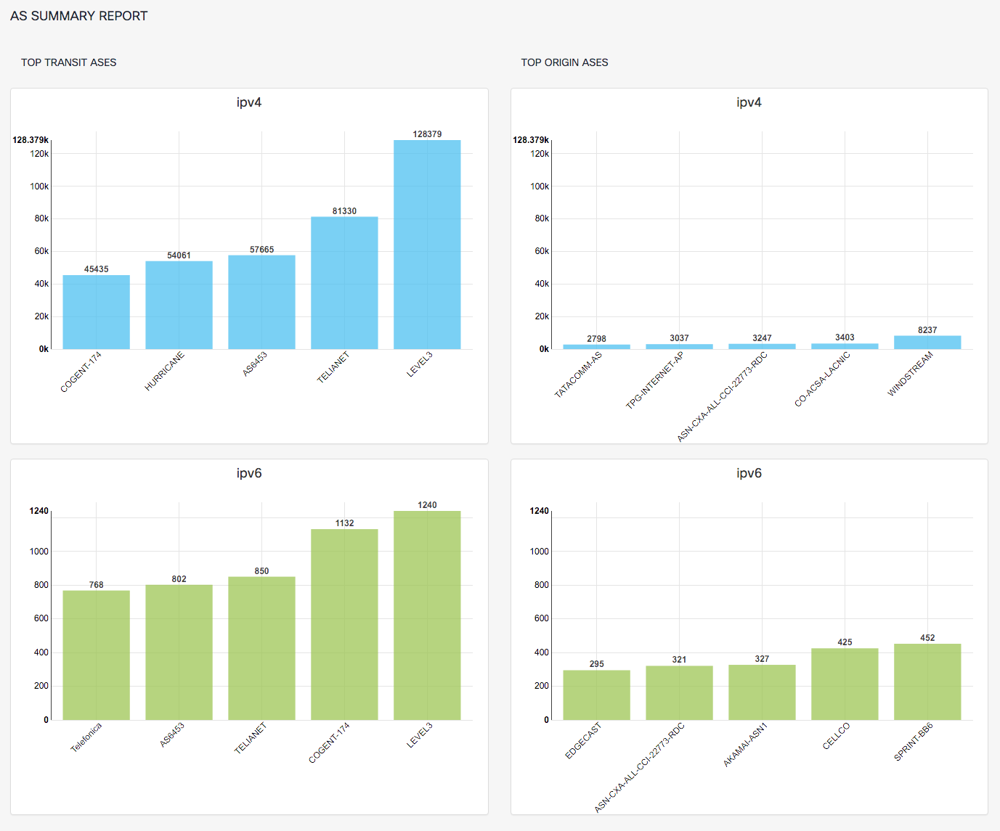

## RIB

Routing table is maintained per BGP peer (pre and post policy)
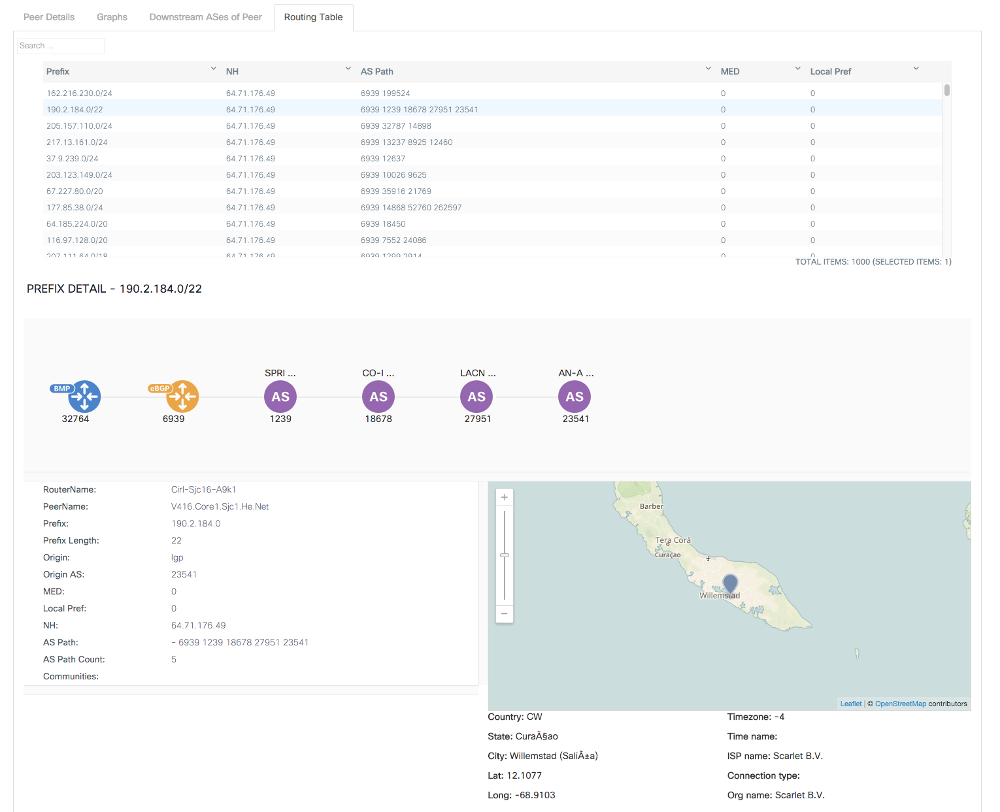

Per peer Pre and Post policy metrics are tracked over time
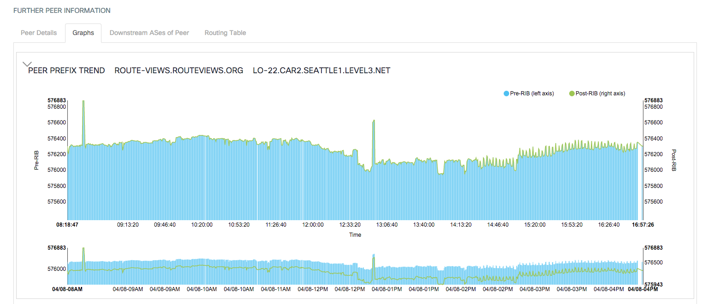

View the history of any prefix. 
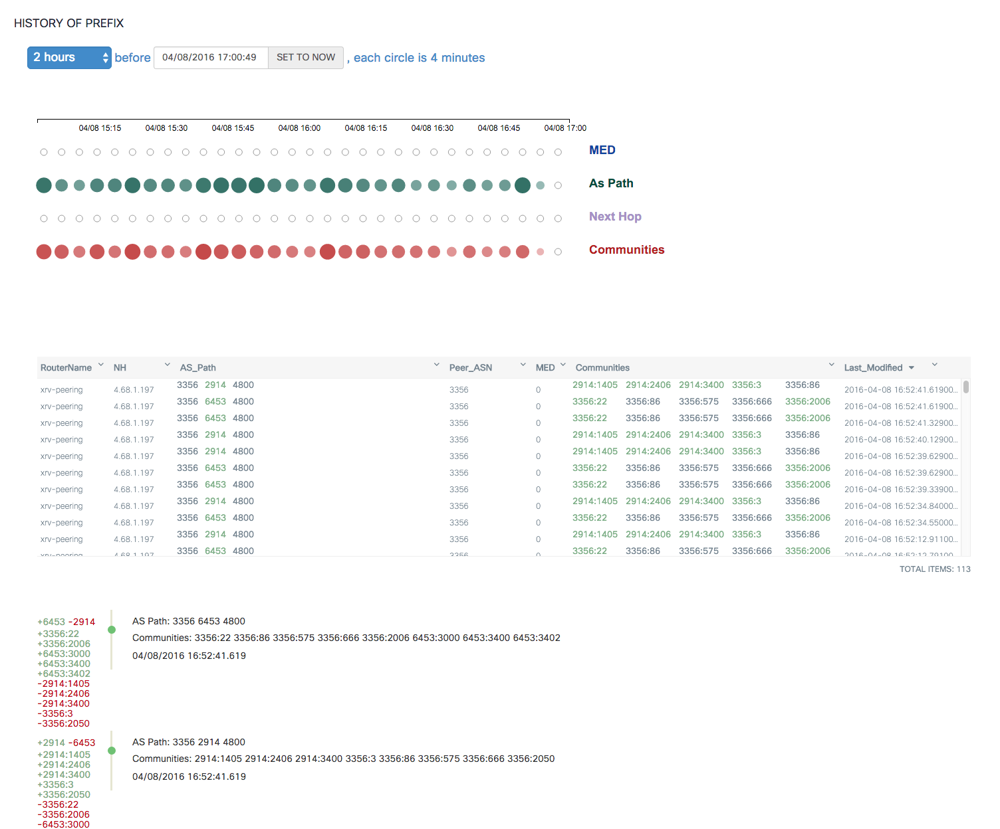

Per peer updates over time
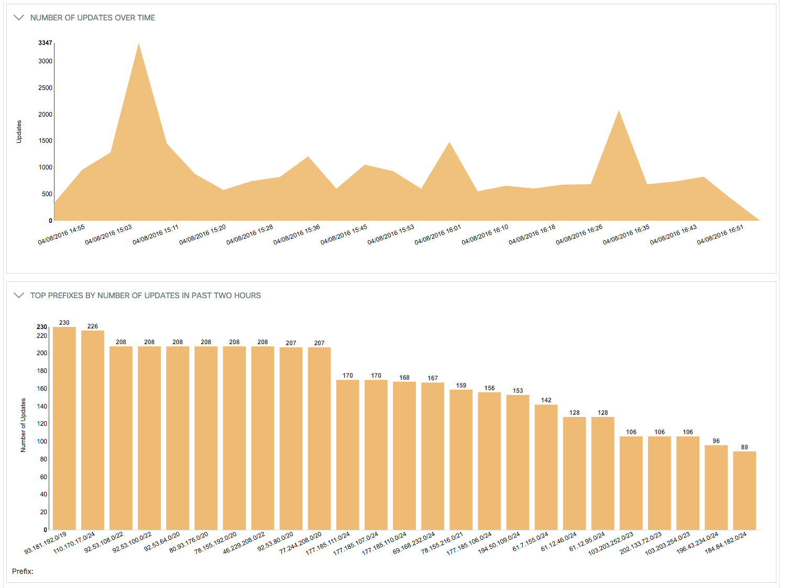

Per peer withdrawals over time


- - -

MySQL Client
------------

**Routes Example** 

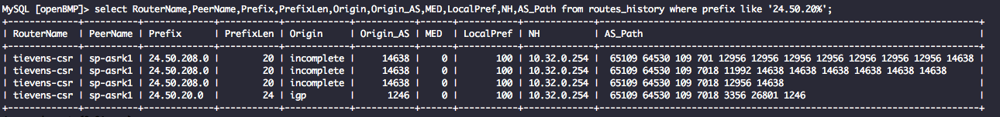

```
MySQL [openBMP]> select RouterName,PeerName,Prefix,PrefixLen,Origin,Origin_AS,MED,LocalPref,NH,AS_Path from routes where prefix like '24.50.20%';
+-------------+----------+-------------+-----------+------------+-----------+------+-----------+-------------+-----------------------------------------------------------------+
| RouterName  | PeerName | Prefix      | PrefixLen | Origin     | Origin_AS | MED  | LocalPref | NH          | AS_Path                                                         |
+-------------+----------+-------------+-----------+------------+-----------+------+-----------+-------------+-----------------------------------------------------------------+
| tievens-csr | sp-asrk1 | 24.50.20.0  |        24 | igp        |      1246 |    0 |       100 | 10.32.0.254 |  65109 64530 109 701 3356 26801 1246                            |
| tievens-csr | sp-asrk1 | 24.50.208.0 |        20 | incomplete |     14638 |    0 |       100 | 10.32.0.254 |  65109 64530 109 7018 11992 14638 14638 14638 14638 14638 14638 |
+-------------+----------+-------------+-----------+------------+-----------+------+-----------+-------------+-----------------------------------------------------------------+
```


**Routes History Example**

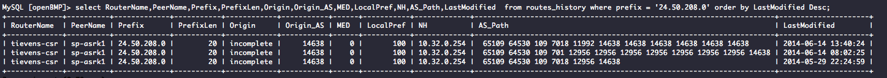

```
MySQL [openBMP]> select RouterName,PeerName,Prefix,PrefixLen,Origin,Origin_AS,MED,LocalPref,NH,AS_Path,LastModified  from routes_history where prefix = '24.50.208.0' order by LastModified Desc;
+-------------+----------+-------------+-----------+------------+-----------+------+-----------+-------------+----------------------------------------------------------------------+---------------------+
| RouterName  | PeerName | Prefix      | PrefixLen | Origin     | Origin_AS | MED  | LocalPref | NH          | AS_Path                                                              | LastModified        |
+-------------+----------+-------------+-----------+------------+-----------+------+-----------+-------------+----------------------------------------------------------------------+---------------------+
| tievens-csr | sp-asrk1 | 24.50.208.0 |        20 | incomplete |     14638 |    0 |       100 | 10.32.0.254 |  65109 64530 109 7018 11992 14638 14638 14638 14638 14638 14638      | 2014-06-14 13:40:24 |
| tievens-csr | sp-asrk1 | 24.50.208.0 |        20 | incomplete |     14638 |    0 |       100 | 10.32.0.254 |  65109 64530 109 701 12956 12956 12956 12956 12956 12956 12956 14638 | 2014-06-14 08:02:25 |
| tievens-csr | sp-asrk1 | 24.50.208.0 |        20 | incomplete |     14638 |    0 |       100 | 10.32.0.254 |  65109 64530 109 7018 12956 14638                                    | 2014-05-29 22:24:59 |
+-------------+----------+-------------+-----------+------------+-----------+------+-----------+-------------+----------------------------------------------------------------------+---------------------+
```

